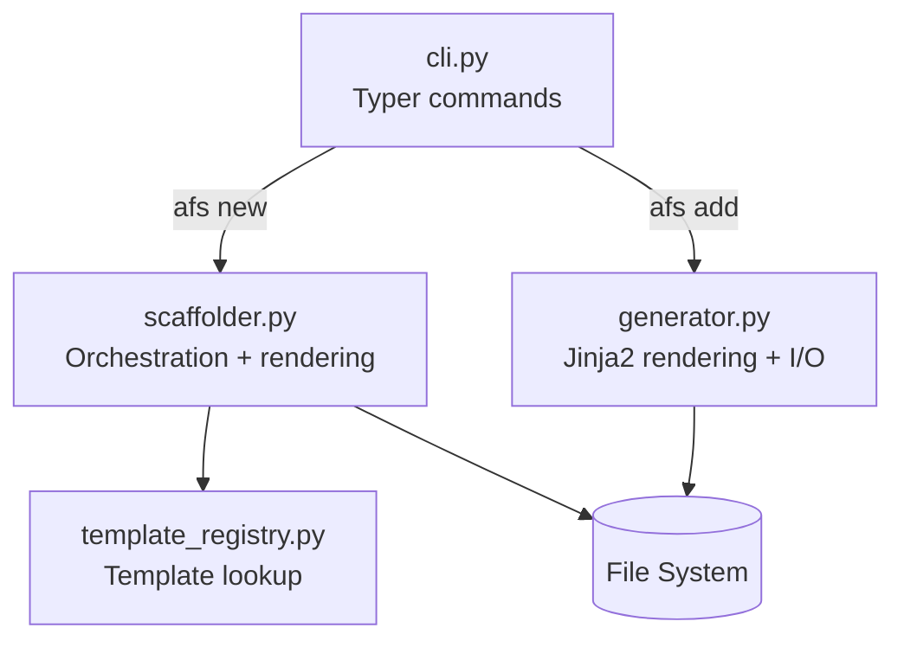

# DESIGN.md

Design Principles for `azure-functions-scaffold`

## Purpose

This document defines the architectural boundaries and design principles of the project.

## Design Goals

- Scaffold Azure Functions Python v2 projects with explicit, maintainable defaults.
- Keep the CLI predictable and easy to understand.
- Generate projects that are immediately testable and lint-clean.
- Keep initial project creation and later project expansion under the same CLI.

## Non-Goals

This project does not aim to:

- Become a full application framework
- Hide Azure Functions runtime concepts
- Generate overly dynamic or highly magical project structures
- Own deployment, infrastructure, or runtime operations

## Design Principles

- The CLI should stay small and obvious.
- Template output should be deterministic.
- Generated code should remain easy to edit by hand.
- Trigger entrypoints and service logic should stay separated.
- Public CLI behavior should evolve conservatively.

## Product Boundaries

- This repository owns project generation, preset handling, and scaffold defaults.
- It may generate code that teams later extend by hand.
- It should not become a deployment framework or runtime abstraction layer.
- It may include local-development guidance for emulator-backed triggers when that keeps
  the generated project directly runnable by a developer.

## Compatibility Policy

- Minimum supported Python version: `3.10`
- Supported runtime target: Azure Functions Python v2 programming model
- Public APIs and CLI behavior follow semantic versioning expectations

## Change Discipline

- Template behavior changes require tests and docs updates.
- Generated-project quality gates are user-facing behavior.
- Experimental templates or commands must be clearly labeled in code and docs.
- Interactive flows must remain scriptable through equivalent non-interactive flags.

## High-Level Architecture

## Sources

- [Azure Functions Python developer reference](https://learn.microsoft.com/en-us/azure/azure-functions/functions-reference-python)
- [Create your first function (Python v2)](https://learn.microsoft.com/en-us/azure/azure-functions/create-first-function-cli-python)
- [Azure Functions host.json reference](https://learn.microsoft.com/en-us/azure/azure-functions/functions-host-json)
- [Supported languages in Azure Functions](https://learn.microsoft.com/en-us/azure/azure-functions/supported-languages)

## See Also

- [azure-functions-validation-python — Architecture](https://github.com/yeongseon/azure-functions-validation-python) — Request/response validation pipeline
- [azure-functions-openapi-python — Architecture](https://github.com/yeongseon/azure-functions-openapi-python) — OpenAPI spec generation
- [azure-functions-logging-python — Architecture](https://github.com/yeongseon/azure-functions-logging-python) — Structured logging with contextvars
- [azure-functions-doctor-python — Architecture](https://github.com/yeongseon/azure-functions-doctor-python) — Pre-deploy diagnostic CLI
- [azure-functions-langgraph-python — Architecture](https://github.com/yeongseon/azure-functions-langgraph-python) — LangGraph agent deployment
