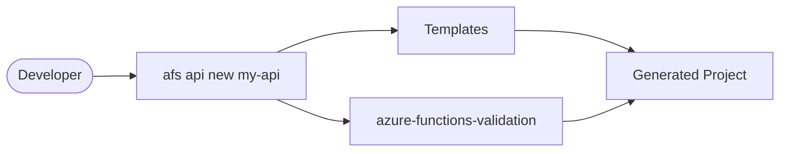

# Azure Functions Scaffold

[](https://pypi.org/project/azure-functions-scaffold/)
[](https://pypi.org/project/azure-functions-scaffold/)
[](https://github.com/yeongseon/azure-functions-scaffold/actions/workflows/ci-test.yml)
[](https://github.com/yeongseon/azure-functions-scaffold/actions/workflows/release.yml)
[](https://github.com/yeongseon/azure-functions-scaffold/actions/workflows/security.yml)
[](https://codecov.io/gh/yeongseon/azure-functions-scaffold)
[](https://pre-commit.com/)
[](https://yeongseon.github.io/azure-functions-scaffold/)
[](LICENSE)

Read this in: [한국어](README.ko.md) | [日本語](README.ja.md) | [简体中文](README.zh-CN.md)

Scaffolding CLI for production-ready Azure Functions Python v2 projects.

## Why Use It

Starting a new Azure Functions project means setting up boilerplate: `host.json`, `function_app.py`, directory structure, tooling config, and tests. `azure-functions-scaffold` generates a production-ready project layout in one command, so you can focus on business logic from the start.


## Scope

- Azure Functions Python **v2 programming model**
- Decorator-based `func.FunctionApp()` applications
- CLI-driven project generation and expansion
- Templates for HTTP, Timer, Queue, Blob, Service Bus triggers, and LangGraph agents

This tool generates project scaffolds. It does **not** provide runtime libraries.

## What this package does not do

This package does not own:

- **Runtime behavior** — intent commands choose optional package wiring during generation, but runtime logic belongs to those packages
- **API documentation** — use [`azure-functions-openapi`](https://github.com/yeongseon/azure-functions-openapi) for API documentation and spec generation
- **Request validation** — use [`azure-functions-validation`](https://github.com/yeongseon/azure-functions-validation) for request/response validation and serialization
- **Database bindings** — use [`azure-functions-db`](https://github.com/yeongseon/azure-functions-db) for database input/output bindings

## Features

- Intent-based command groups: `afs api`, `afs worker`, `afs ai`, and `afs advanced`
- API project commands: `afs api new` and `afs api add`
- Worker project commands: `afs worker timer|queue|blob|servicebus|eventhub`
- AI project command: `afs ai agent` for LangGraph scaffolds
- Advanced power-user commands: `afs advanced new` and `afs advanced add`
- Optional feature flags (`--with-openapi`, `--with-validation`, `--with-doctor`) and `--preset minimal|standard|strict` available via `afs advanced new`
- Discovery commands: `afs templates` and `afs presets`
- Short alias: `afs` is the primary CLI entry point for `azure-functions-scaffold`

## Installation

```bash
pip install azure-functions-scaffold
```

## Quick Start

Use this 4-step flow to create and run a local HTTP function:

1. Install the CLI.
2. Generate a new project.
3. Install project dependencies.
4. Start the local Functions runtime.

```bash
afs api new my-api
cd my-api
pip install -e .
func start
```

Open `http://localhost:7071/api/health` in your browser.

Expected response:

```json
{"status": "healthy"}
```

Project names must start with an alphanumeric character and use only letters,
numbers, hyphens, or underscores.

## What You Get

The generated layout separates trigger bindings, business logic, shared runtime
concerns, and tests so teams can scale endpoints without coupling everything to
`function_app.py`.

```text
my-api/
|- function_app.py          # Azure Functions v2 entrypoint
|- host.json                # Runtime configuration
|- local.settings.json.example
|- pyproject.toml           # Dependencies and tooling config
|- app/
|  |- core/
|  |  |- config.py          # Application settings
|  |  `- logging.py         # Structured JSON logging
|  |- dependencies/
|  |  `- __init__.py        # Shared dependencies
|  |- functions/
|  |  |- health.py          # Health check (Blueprint)
|  |  `- users.py           # Users CRUD (Blueprint)
|  |- schemas/
|  |  `- users.py           # Pydantic request/response models
|  `- services/
|     |- health_service.py   # Health check logic
|     `- users_service.py    # Users business logic
`- tests/
   |- test_health.py        # Health endpoint tests
   `- test_users.py         # Users CRUD tests
```

Why this layout works:

- Keep trigger-specific code in `app/functions`.
- Keep reusable business rules in `app/services`.
- Keep model contracts in `app/schemas`.
- Keep observability and runtime helpers in `app/core`.
- Keep integration checks in `tests`.

## Templates

| Template | Command | Use Case |
| --- | --- | --- |
| http | `afs api new my-api` | REST APIs, webhooks |
| timer | `afs worker timer my-job` | Scheduled tasks, cron |
| queue | `afs worker queue my-worker` | Message processing (Azurite) |
| blob | `afs worker blob my-blob` | File processing (Azurite) |
| servicebus | `afs worker servicebus my-bus` | Enterprise messaging |
| langgraph | `afs ai agent my-agent` | LangGraph AI agent deployment |

Note: `afs` is short for `azure-functions-scaffold`. Both work.

Template defaults:

- `http`: health endpoint and users CRUD with service layer.
- `timer`: scheduled trigger using NCRONTAB expression settings.
- `queue`: Storage Queue trigger ready for local Azurite development.
- `blob`: Blob trigger scaffold for file-ingestion pipelines.
- `servicebus`: Service Bus trigger scaffold with development placeholders.

## Optional Features

Intent commands pre-select optional features based on project intent:

- `afs api new <name>` includes OpenAPI, validation, and doctor integration
- `afs worker <trigger> <name>` and `afs ai agent <name>` apply trigger-specific defaults

Use `afs advanced new <name>` when you need direct control over feature flags:

- `--with-openapi` - Swagger UI + OpenAPI spec endpoints
- `--with-validation` - Pydantic request/response validation
- `--with-doctor` - Health check diagnostics
- `--with-db` - Database bindings (SQLAlchemy) *(planned — currently not wired)*
- `--preset minimal|standard|strict` - Tooling level
## Expand Your Project

Add functions to an existing scaffolded project:

```bash
afs api add get-user --project-root ./my-api
afs advanced add timer cleanup --project-root ./my-api
afs advanced add queue sync-jobs --project-root ./my-api
afs advanced add blob ingest-reports --project-root ./my-api
afs advanced add servicebus process-events --project-root ./my-api
```

Preview additions before writing files:

```bash
afs advanced add servicebus process-events --project-root ./my-api --dry-run
```

Common expansion flow:

1. Add API endpoints with `afs api add <name>` or non-HTTP triggers with `afs advanced add <trigger> <name>`.
2. Implement business logic under `app/services`.
3. Update contracts in `app/schemas` if needed.
4. Add or update tests in `tests`.

## Deploy

```bash
func azure functionapp publish <APP_NAME>
```

Before publishing:

- Set required app settings for production connections.
- Review `host.json` and function auth levels.
- Run your project checks (`pytest`, lint, and formatting).
- Verify startup locally with `func start`.

## Documentation

- Full docs: [yeongseon.github.io/azure-functions-scaffold](https://yeongseon.github.io/azure-functions-scaffold/)
- Getting Started: [`docs/guide/getting-started.md`](docs/guide/getting-started.md)
- CLI Reference: [`docs/reference/cli.md`](docs/reference/cli.md)
- Project Structure: [`docs/guide/project-structure.md`](docs/guide/project-structure.md)
- Templates: [`docs/guide/templates.md`](docs/guide/templates.md)
- Troubleshooting: [`docs/guide/troubleshooting.md`](docs/guide/troubleshooting.md)

## Development

Use Makefile commands as the canonical entry points:

```bash
make install
make check-all
make docs
make build
```

## Ecosystem

This package is part of the **Azure Functions Python DX Toolkit**.

**Design principle:** `azure-functions-scaffold` owns project generation and template expansion. It does not provide runtime libraries — runtime behavior belongs to [`azure-functions-openapi`](https://github.com/yeongseon/azure-functions-openapi) (API documentation and spec generation), [`azure-functions-validation`](https://github.com/yeongseon/azure-functions-validation) (request/response validation), and [`azure-functions-langgraph`](https://github.com/yeongseon/azure-functions-langgraph) (LangGraph runtime exposure).

| Package | Role |
|---------|------|
| [azure-functions-openapi](https://github.com/yeongseon/azure-functions-openapi) | OpenAPI spec generation and Swagger UI |
| [azure-functions-validation](https://github.com/yeongseon/azure-functions-validation) | Request/response validation and serialization |
| [azure-functions-db](https://github.com/yeongseon/azure-functions-db) | Database bindings for SQL, PostgreSQL, MySQL, SQLite, and Cosmos DB |
| [azure-functions-langgraph](https://github.com/yeongseon/azure-functions-langgraph) | LangGraph deployment adapter for Azure Functions |
| **azure-functions-scaffold** | Project scaffolding CLI |
| [azure-functions-logging](https://github.com/yeongseon/azure-functions-logging) | Structured logging and observability |
| [azure-functions-doctor](https://github.com/yeongseon/azure-functions-doctor) | Pre-deploy diagnostic CLI |
| [azure-functions-durable-graph](https://github.com/yeongseon/azure-functions-durable-graph) | Manifest-first graph runtime with Durable Functions *(experimental)* |
| [azure-functions-python-cookbook](https://github.com/yeongseon/azure-functions-python-cookbook) | Recipes and examples |

## For AI Coding Assistants

This package includes `llms.txt` and `llms-full.txt` files in the repository root designed specifically for LLM-assisted development:

- **`llms.txt`** — Concise overview of the CLI, commands, templates, and quick start
- **`llms-full.txt`** — Complete CLI reference with all options, patterns, and workflows

Use these files to provide context to AI coding assistants when working with Azure Functions scaffolding.

Reference:
- Repository: https://github.com/yeongseon/azure-functions-scaffold
- Issue: [#40](https://github.com/yeongseon/azure-functions-scaffold/issues/40)

## Disclaimer

This project is an independent community project and is not affiliated with,
endorsed by, or maintained by Microsoft.

Azure and Azure Functions are trademarks of Microsoft Corporation.

## License

MIT
