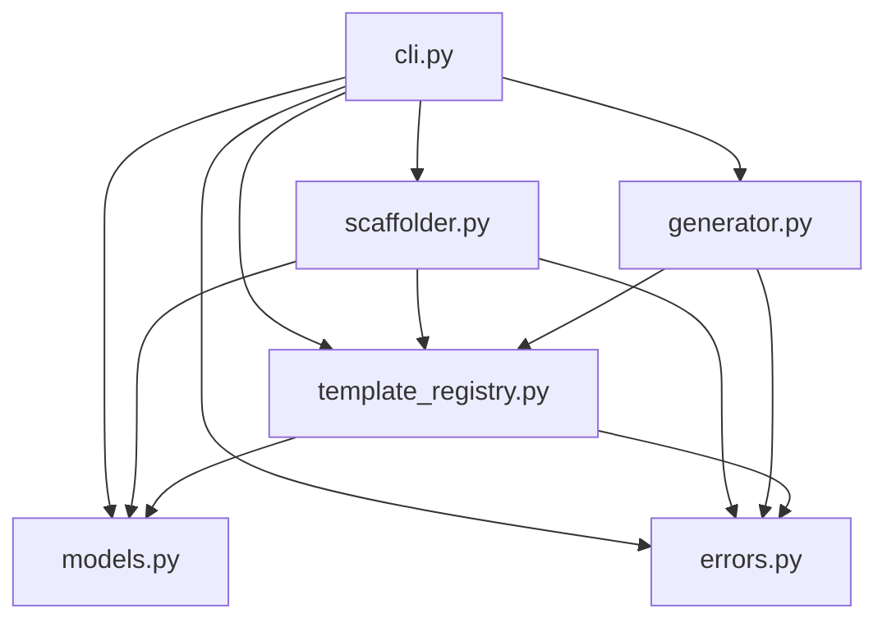
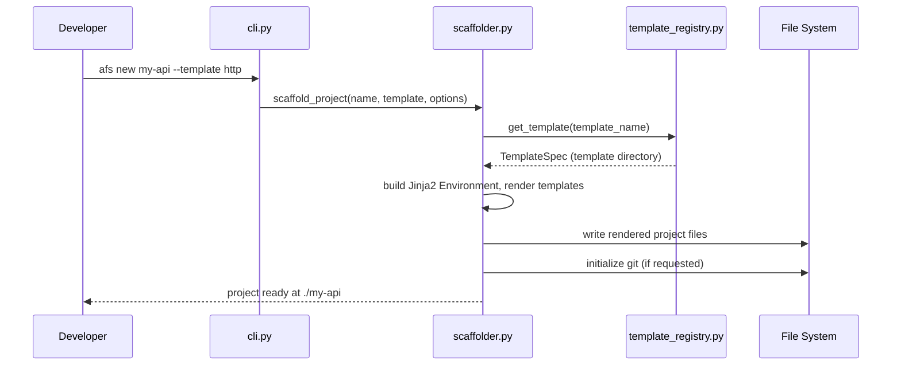
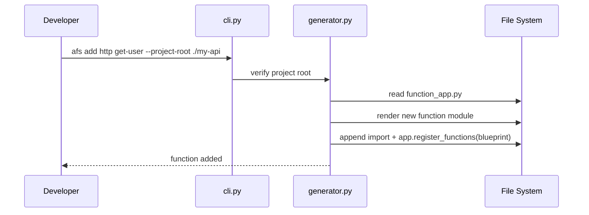
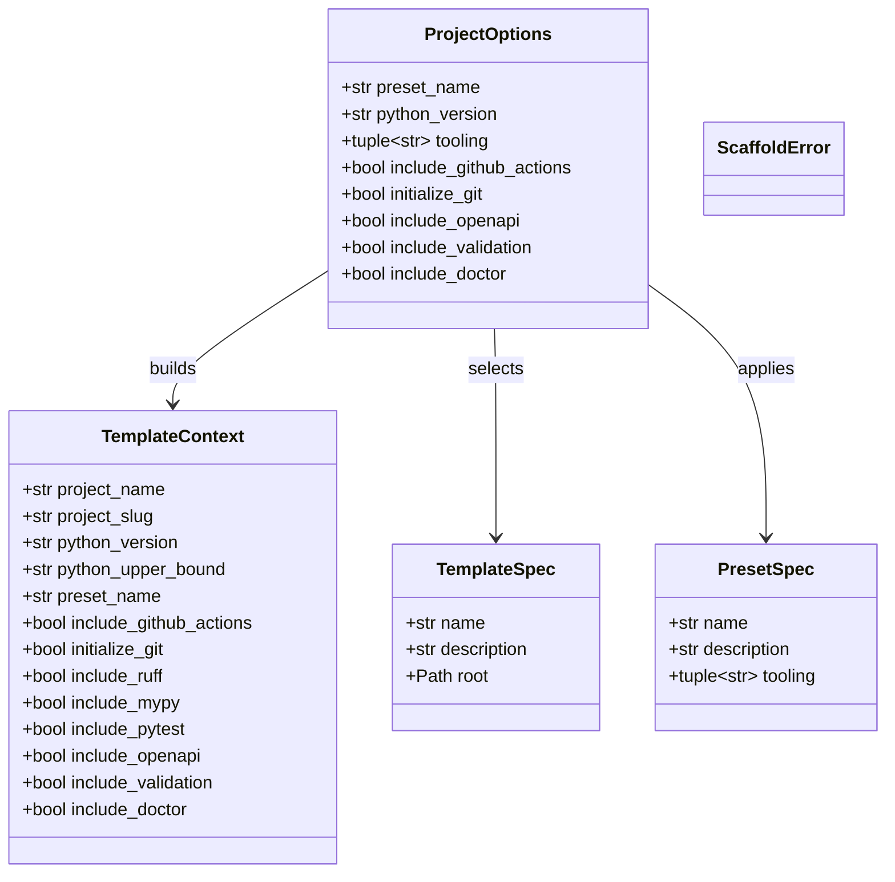

# Architecture

Internal structure and design principles for `azure-functions-scaffold`.

## Design Objectives

1. **Offline-first generation** — All templates ship with the package; no network calls during scaffolding.
2. **Deterministic output** — Given identical inputs, the scaffolded project is identical every run.
3. **Python v2 programming model only** — Targets the Azure Functions Python v2 model exclusively.
4. **Conservative CLI evolution** — Public CLI behaviour follows semver; no silent breaking changes.
5. **Template-driven trigger support** — New trigger types are added as template directories in `templates/`, with a corresponding `TemplateSpec` entry in `template_registry.py`. The orchestration layer (`scaffolder.py`) requires no changes, though `generator.py` may need trigger-specific rendering or post-processing logic.

## Overview

A CLI tool built with Typer and Jinja2. It provides offline-capable, deterministic project generation for Azure Functions Python v2.

## Runtime Flow

### `new` Command

1. **CLI Parsing**: `cli.py` receives user input and options via Typer.
2. **Options Resolution**: `template_registry.py` builds a `ProjectOptions` instance from CLI inputs and preset defaults.
3. **Template Discovery**: `template_registry.py` identifies the requested template path.
4. **Context Preparation**: `scaffolder.py` builds the `TemplateContext` from `ProjectOptions`.
5. **Generation**: `scaffolder.py` drives Jinja2 rendering via its own render loop and writes to the filesystem.
6. **Post-Processing**: `scaffolder.py` initializes git or runs optional checks if requested.

### `add` Command

1. **Root Verification**: `generator.py` ensures the target directory is a valid scaffolded project.
2. **Function Rendering**: `generator.py` creates the function module and test file.
3. **Registration**: `generator.py` updates `function_app.py` with the new import and registration.
4. **Settings Update**: `generator.py` ensures `host.json` and `local.settings.json` have required entries.

## Module Boundaries

| Module | Responsibility |
| :--- | :--- |
| `cli.py` | Entry point, CLI command definitions, Typer logic. |
| `scaffolder.py` | Project scaffolding: template resolution, Jinja2 rendering, file I/O, git init. |
| `generator.py` | Function module generation for `afs add`: renders function files, updates `function_app.py` registration. |
| `template_registry.py` | Mapping template names to source directories. |
| `models.py` | Data structures, type definitions, and validation logic. |
| `errors.py` | Custom exception types for the scaffolding lifecycle. |
| `templates/` | Source Jinja2 and static files for project generation. |

## Public API Boundary

`azure-functions-scaffold` is primarily a CLI tool. The package root exports only `__version__` via `__all__`.

### CLI entry point (`afs` / `azure-functions-scaffold`)

| Command | Description |
| :--- | :--- |
| `afs new` | Scaffold a new Azure Functions Python v2 project |
| `afs add` | Add a function module to an existing scaffolded project |
| `afs templates` | List available scaffold templates |
| `afs presets` | List available project presets |

### Documented module-level API

The following functions and types are importable and documented in the [API Reference](api.md), but are not re-exported from `__init__.py`.

| Symbol | Module | Kind |
| :--- | :--- | :--- |
| `scaffold_project()` | `scaffolder` | function |
| `describe_scaffold_project()` | `scaffolder` | function |
| `add_function()` | `generator` | function |
| `describe_add_function()` | `generator` | function |
| `list_templates()` | `template_registry` | function |
| `list_presets()` | `template_registry` | function |
| `build_project_options()` | `template_registry` | function |
| `ProjectOptions` | `models` | frozen dataclass |
| `TemplateContext` | `models` | frozen dataclass |
| `TemplateSpec` | `models` | frozen dataclass |
| `PresetSpec` | `models` | frozen dataclass |
| `ScaffoldError` | `errors` | exception |

## Data Model

- **`TemplateContext`**: Frozen dataclass holding all Jinja2 template variables (project name, slug, Python version, feature flags such as `include_openapi`, `include_ruff`, etc.).
- **`ProjectOptions`**: Frozen dataclass for validated CLI inputs (preset name, Python version, tooling tuple, feature flags).
- **`TemplateSpec`**: Frozen dataclass for trigger template metadata (name, description, root path).
- **`PresetSpec`**: Frozen dataclass for preset configuration (name, description, tooling tuple).
- **`ScaffoldError`**: Single domain exception (`RuntimeError` subclass) for all scaffolding failures.

## Template System

- **Bundled**: All templates are shipped with the package; no network calls required.
- **Offline**: No external API dependencies during the generation process.
- **Deterministic**: Given the same inputs, the generated output is identical every time.
- **Conditional Rendering**: Uses Jinja2 logic for optional features like OpenAPI or validation.

## Design Constraints

- **Python v2 Programming Model Only**: Does not support the legacy v1 model.
- **Zero Runtime Dependencies for Generated Projects**: Generated code uses standard libraries or specified Azure packages only.
- **Explicit over Implicit**: No hidden configuration files; all generation logic is visible in templates.

## Dependency Graph

## Runtime Sequence

### `afs new` flow

### `afs add` flow

## Class Diagram

## Key Design Decisions

### 1. Typer for CLI framework

Typer provides type-annotated command definitions with automatic help generation. The CLI stays small and declarative.

### 2. Jinja2 for template rendering

Templates are standard Jinja2 with `.j2` extension stripping. This keeps templates readable and editable without custom DSL knowledge.

### 3. Blueprint-based function registration

Generated scaffolded projects use `func.Blueprint()` for modular registration. Each trigger gets its own module under `app/functions/`, imported and registered in `function_app.py` via marker comments.

### 4. Frozen dataclasses for configuration

`ProjectOptions`, `TemplateContext`, `TemplateSpec`, and `PresetSpec` are all `@dataclass(frozen=True)`. Immutability prevents accidental mutation during the rendering pipeline.

### 5. Single domain exception

The project uses a single domain exception, `ScaffoldError(RuntimeError)`. The CLI catches `ScaffoldError` at the top level and converts it to a coloured error message with exit code 1.

### 6. Marker-based function_app.py updates

The `add` command inserts imports and registrations using marker comments (`# azure-functions-scaffold: function imports` / `# azure-functions-scaffold: function registrations`). This avoids AST manipulation while keeping updates predictable.

## Related Documents

- [CLI Reference](cli.md)
- [Template Spec Reference](template-spec.md)
- [API Reference](api.md)
- [Testing Guide](../testing.md)
- [FAQ](../faq.md)

## Sources

- [Azure Functions Python developer reference](https://learn.microsoft.com/en-us/azure/azure-functions/functions-reference-python)
- [Create your first function (Python v2)](https://learn.microsoft.com/en-us/azure/azure-functions/create-first-function-cli-python)
- [Azure Functions host.json reference](https://learn.microsoft.com/en-us/azure/azure-functions/functions-host-json)
- [Supported languages in Azure Functions](https://learn.microsoft.com/en-us/azure/azure-functions/supported-languages)

## See Also

- [azure-functions-validation — Architecture](https://github.com/yeongseon/azure-functions-validation) — Request/response validation and serialization
- [azure-functions-openapi — Architecture](https://github.com/yeongseon/azure-functions-openapi) — API documentation and spec generation
- [azure-functions-logging — Architecture](https://github.com/yeongseon/azure-functions-logging) — Structured logging with contextvars
- [azure-functions-doctor — Architecture](https://github.com/yeongseon/azure-functions-doctor) — Pre-deploy diagnostic CLI
- [azure-functions-langgraph — Architecture](https://github.com/yeongseon/azure-functions-langgraph) — LangGraph runtime exposure for Azure Functions
