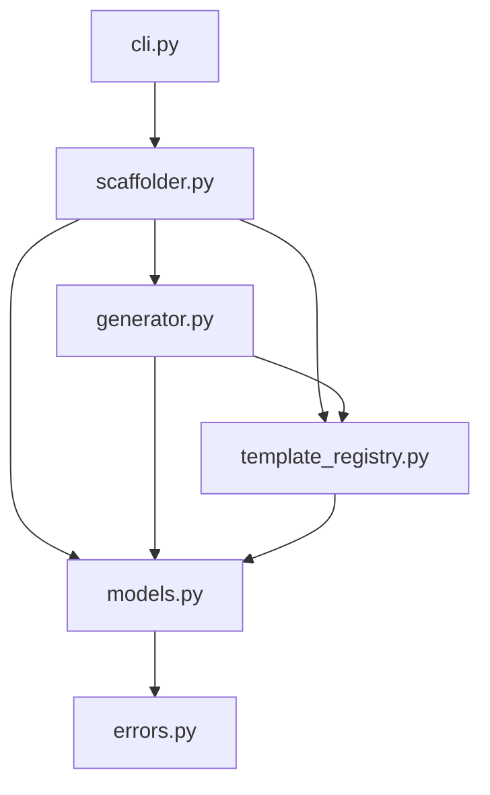

# Architecture

Internal structure and design principles for `azure-functions-scaffold`.

## Overview

A CLI tool built with Typer and Jinja2. It provides offline-capable, deterministic project generation for Azure Functions Python v2.

## Runtime Flow

### `new` Command

1. **CLI Parsing**: `cli.py` receives user input and options via Typer.
2. **Options Normalization**: `scaffolder.py` creates a `ProjectOptions` instance.
3. **Template Discovery**: `template_registry.py` identifies the requested template path.
4. **Context Preparation**: `models.py` builds the `TemplateContext` object.
5. **Generation**: `generator.py` processes Jinja2 templates and writes to the filesystem.
6. **Post-Processing**: `scaffolder.py` initializes git or runs optional checks if requested.

### `add` Command

1. **Root Verification**: `generator.py` ensures the target directory is a valid scaffolded project.
2. **Function Rendering**: `generator.py` creates the function module and test file.
3. **Registration**: `generator.py` updates `function_app.py` with the new import and registration.
4. **Settings Update**: `generator.py` ensures `host.json` and `local.settings.json` have required entries.

## Module Boundaries

| Module | Responsibility |
| :--- | :--- |
| `cli.py` | Entry point, CLI command definitions, Typer logic. |
| `scaffolder.py` | High-level workflow coordination and orchestration. |
| `generator.py` | Jinja2 rendering, file system I/O, placeholder expansion. |
| `template_registry.py` | Mapping template names to source directories. |
| `models.py` | Data structures, type definitions, and validation logic. |
| `errors.py` | Custom exception types for the scaffolding lifecycle. |
| `templates/` | Source Jinja2 and static files for project generation. |

## Data Model

- **`TemplateContext`**: Flat dictionary containing all variables for Jinja2 rendering.
- **`ProjectOptions`**: Frozen dataclass for validated CLI inputs.
- **`TemplateSpec`**: Metadata for a trigger template (name, description, default files).
- **`PresetSpec`**: Configuration object defining which linters and test tools to include.
- **`ScaffoldError`**: Base exception class for all tool-specific errors.

## Template System

- **Bundled**: All templates are shipped with the package; no network calls required.
- **Offline**: No external API dependencies during the generation process.
- **Deterministic**: Given the same inputs, the generated output is identical every time.
- **Conditional Rendering**: Uses Jinja2 logic for optional features like OpenAPI or validation.

## Design Constraints

- **Python v2 Programming Model Only**: Does not support the legacy v1 model.
- **Zero Runtime Dependencies for Generated Projects**: Generated code uses standard libraries or specified Azure packages only.
- **Explicit over Implicit**: No hidden configuration files; all generation logic is visible in templates.

## Dependency Graph

