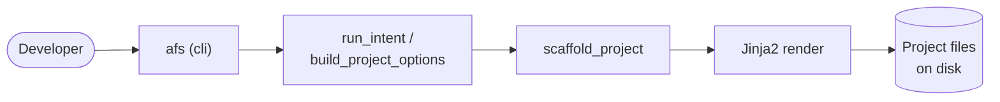

# CLI Reference

Technical specification for the `azure-functions-scaffold` (alias: `afs`) command-line interface.

The CLI is organized into intent-centric subcommand groups (`api`, `worker`, `ai`, `advanced`)
plus a few top-level shortcuts. The following diagram shows how a command flows from the CLI
surface through the intent pipeline to the filesystem:

## Command Overview

!!! tip "See what gets generated"
    For per-template project trees and `function_app.py` / `host.json` snippets showing exactly
    what each command produces, see [Generated Output](../guide/generated-output.md).

| Command | Kind | Purpose |
| :--- | :--- | :--- |
| `afs new` | shortcut | Alias for `afs api new` (HTTP REST API project). |
| `afs api new` | group | Create a REST API project (OpenAPI + validation + doctor). |
| `afs api add` | group | Add an HTTP function to an existing project. |
| `afs api add-route` | group | Add a single HTTP route to an existing project. |
| `afs api add-resource` | group | Add a full CRUD resource (blueprint, service, schema, test). |
| `afs worker timer\|queue\|blob\|servicebus\|eventhub` | group | Create a background worker project for the given trigger. |
| `afs ai agent` | group | Create a LangGraph agent project. |
| `afs advanced new` | group | Power-user project creation with full option control. |
| `afs advanced add` | group | Add a function of any trigger type to an existing project. |
| `afs advanced add-route` / `add-resource` | group | Route/resource variants for power users. |
| `afs advanced templates` / `presets` | group | List templates/presets (mirrors the top-level commands). |
| `afs templates` | top-level | List available scaffold templates. |
| `afs presets` | top-level | List available project presets and their tooling. |
| `afs add` | deprecated | Shim forwarding to `afs api add` / `afs advanced add`. |
| `afs profiles` | deprecated | Shim forwarding to `afs presets`. |
| `afs --version` | top-level | Print the installed version and exit. |

> **Note:** The top-level `afs new` is a **shortcut for `afs api new`** (HTTP template only). It
> does **not** accept `--template`, `--preset`, or `--with-openapi/--with-validation/--with-doctor`.
> Those flags live on `afs advanced new`. To scaffold a non-HTTP trigger use `afs worker <type>`,
> `afs ai agent`, or `afs advanced new --template <name>`.

## Shared Scaffold Options

Every project-creation command (`afs new`, `afs api new`, `afs worker <type>`, `afs ai agent`)
accepts the same option set:

| Flag | Default | Values | Description |
| :--- | :--- | :--- | :--- |
| `--destination`, `-d` | `.` | Path | Base directory where the project folder is created. |
| `--python-version` | `3.10` | `3.10`, `3.11`, `3.12`, `3.13`, `3.14 (Preview)` | Target Python version. `3.14` emits a Preview warning. |
| `--github-actions` / `--no-github-actions` | `--no-github-actions` | Boolean | Include a basic GitHub Actions CI workflow. |
| `--git` / `--no-git` | `--no-git` | Boolean | Initialize a git repository in the generated project. |
| `--azd` / `--no-azd` | `--no-azd` | Boolean | Include Azure Developer CLI (`azd`) support files. |
| `--dry-run` | `False` | Boolean | Preview the generated project without writing files. |
| `--overwrite` | `False` | Boolean | Replace an existing target directory before generating. |
| `--yes`, `-y` | `False` | Boolean | Skip confirmation prompts (required when `--overwrite` runs in a non-TTY session or against a directory containing `.git/`). |

When `--overwrite` is used in an interactive TTY, the CLI prompts before deleting the target
directory and defaults to No. In non-interactive sessions, `--overwrite` is refused unless `--yes`
is also passed. As an extra safety guard, any target directory containing `.git/` also requires
`--yes` before it can be deleted.

## Top-Level Commands

### `new`

Shortcut for `afs api new`: generates a new HTTP REST API project.

- **Synopsis**: `afs new PROJECT_NAME [OPTIONS]`
- **Arguments**: `PROJECT_NAME` (required) — directory name for the new project. Must be a valid
  project identifier (letters, numbers, hyphens, or underscores).
- **Options**: the [Shared Scaffold Options](#shared-scaffold-options) above.

### `templates`

Lists all available scaffold templates.

- **Synopsis**: `afs templates`

### `presets`

Lists all available project presets and their included tooling.

- **Synopsis**: `afs presets`

### `--version`

Shows the installed version of the CLI tool.

- **Synopsis**: `afs --version`

## `afs api` — REST API Scaffolding

### `api new`

Create a REST API project with OpenAPI, validation, and doctor enabled.

- **Synopsis**: `afs api new PROJECT_NAME [OPTIONS]`
- **Options**: the [Shared Scaffold Options](#shared-scaffold-options).

### `api add`

Add an HTTP function to an existing API project.

- **Synopsis**: `afs api add FUNCTION_NAME [OPTIONS]`
- **Options**: `--project-root` (default `.`), `--dry-run`.

### `api add-route`

Add a single HTTP route to an existing API project.

- **Synopsis**: `afs api add-route ROUTE_NAME [OPTIONS]`
- **Options**: `--project-root` (default `.`), `--dry-run`.

### `api add-resource`

Add a full CRUD resource (blueprint, service, schema, and test) to an existing API project.

- **Synopsis**: `afs api add-resource RESOURCE_NAME [OPTIONS]`
- **Options**: `--project-root` (default `.`), `--dry-run`.

## `afs worker` — Background Worker Scaffolding

Each subcommand creates a worker project for the named trigger and accepts the
[Shared Scaffold Options](#shared-scaffold-options).

| Command | Trigger |
| :--- | :--- |
| `afs worker timer PROJECT_NAME` | Timer trigger |
| `afs worker queue PROJECT_NAME` | Queue trigger |
| `afs worker blob PROJECT_NAME` | Blob trigger |
| `afs worker servicebus PROJECT_NAME` | Service Bus trigger |
| `afs worker eventhub PROJECT_NAME` | Event Hub trigger |

## `afs ai` — AI Agent Scaffolding

### `ai agent`

Create a LangGraph agent project.

- **Synopsis**: `afs ai agent PROJECT_NAME [OPTIONS]`
- **Options**: the [Shared Scaffold Options](#shared-scaffold-options).

## `afs advanced` — Power-User Scaffolding

### `advanced new`

Create a new project with full option control, including template and preset selection.

- **Synopsis**: `afs advanced new PROJECT_NAME [OPTIONS]`

| Flag | Default | Values | Description |
| :--- | :--- | :--- | :--- |
| `--destination`, `-d` | `.` | Path | Base directory for the project. |
| `--template`, `-t` | `http` | `http`, `timer`, `queue`, `blob`, `servicebus`, `eventhub`, `cosmosdb`, `durable`, `ai`, `langgraph` | Template to render. |
| `--preset` | `standard` | `minimal`, `standard`, `strict` | Project preset (tooling configuration). |
| `--python-version` | `3.10` | `3.10`–`3.14 (Preview)` | Target Python version. |
| `--github-actions` / `--no-github-actions` | `--no-github-actions` | Boolean | Include a GitHub Actions CI workflow. |
| `--git` / `--no-git` | `--no-git` | Boolean | Initialize a git repository. |
| `--with-openapi` / `--no-openapi` | `--no-openapi` | Boolean | Include OpenAPI support (HTTP template only). |
| `--with-validation` / `--no-validation` | `--no-validation` | Boolean | Include request validation (HTTP template only). |
| `--with-doctor` / `--no-doctor` | `--no-doctor` | Boolean | Include `azure-functions-doctor` health checks. |
| `--azd` / `--no-azd` | `--no-azd` | Boolean | Include Azure Developer CLI (`azd`) support files. |
| `--dry-run` | `False` | Boolean | Preview without writing files. |
| `--overwrite` | `False` | Boolean | Replace an existing target directory. |
| `--yes`, `-y` | `False` | Boolean | Skip confirmation prompts. |

Feature flags are validated against the chosen template *before* any files are written. For
example, `--with-openapi` against the `langgraph` template errors out cleanly. See the
[template spec](template-spec.md) for the allowed feature set per template.

### `advanced add`

Add a function module of any trigger type to an existing project.

- **Synopsis**: `afs advanced add TRIGGER FUNCTION_NAME [OPTIONS]`
- **Arguments**: `TRIGGER` (one of the addable triggers), `FUNCTION_NAME`.
- **Options**: `--project-root` (default `.`), `--dry-run`.

### `advanced add-route` / `advanced add-resource`

Route and resource variants mirroring `afs api add-route` / `afs api add-resource`.

- **Synopsis**: `afs advanced add-route ROUTE_NAME [OPTIONS]` /
  `afs advanced add-resource RESOURCE_NAME [OPTIONS]`
- **Options**: `--project-root` (default `.`), `--dry-run`.

### `advanced templates` / `advanced presets`

List available templates/presets. Equivalent to the top-level `afs templates` / `afs presets`.

## Deprecated Commands

These commands still work but print a one-time stderr deprecation warning and will be removed in a
future major release. See the [0.6.0 migration guide](../migration/0.6.0.md#7-cli-ergonomic-changes).

| Deprecated | Replacement |
| :--- | :--- |
| `afs add TRIGGER FUNCTION_NAME` | `afs api add` (http) or `afs advanced add <trigger>` |
| `afs profiles` | `afs presets` |

## Exit Codes

| Code | Meaning |
| :--- | :--- |
| `0` | Success |
| `1` | Validation error or runtime failure |

## Error Conditions

The CLI returns exit code `1` under the following conditions:

- **Directory Conflict**: Destination directory is not empty and `--overwrite` is not set.
- **Invalid Template**: Specified trigger template does not exist in the registry.
- **Invalid Preset**: Specified preset name is not recognized.
- **Unsupported Feature Flag**: A `--with-*` flag (OpenAPI/validation/doctor) is not allowed for the chosen template. (`--azd` is allowed for every template.)
- **Python Version Mismatch**: Host Python version is lower than required by the tool.
- **Missing Project Root**: an `add` command executed outside a valid scaffolded project.
- **Validation Failure**: Project/function name contains illegal characters or is a Python keyword.
